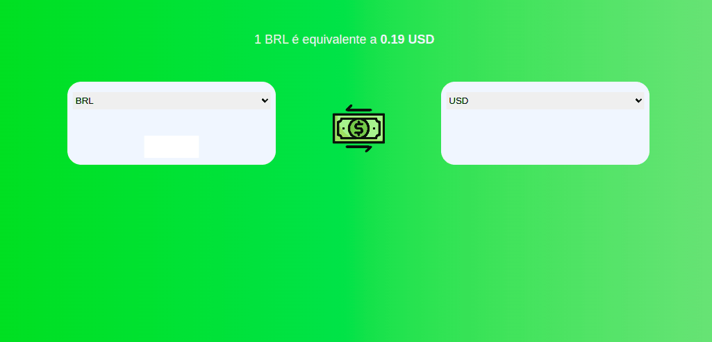

# Conversor de Moedas
### Conversor de moedas desenvolvido apenas com HTML, CSS e Javascript

* Utiliza-se a API [Exchanger Rate](https://www.exchangerate-api.com) para consultar a taxa de câmbio atual
#### Situação atual: https://evertonnasac.github.io/conversor-de-moedas/

